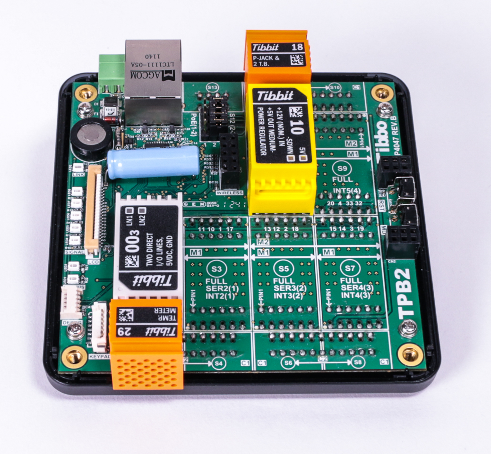
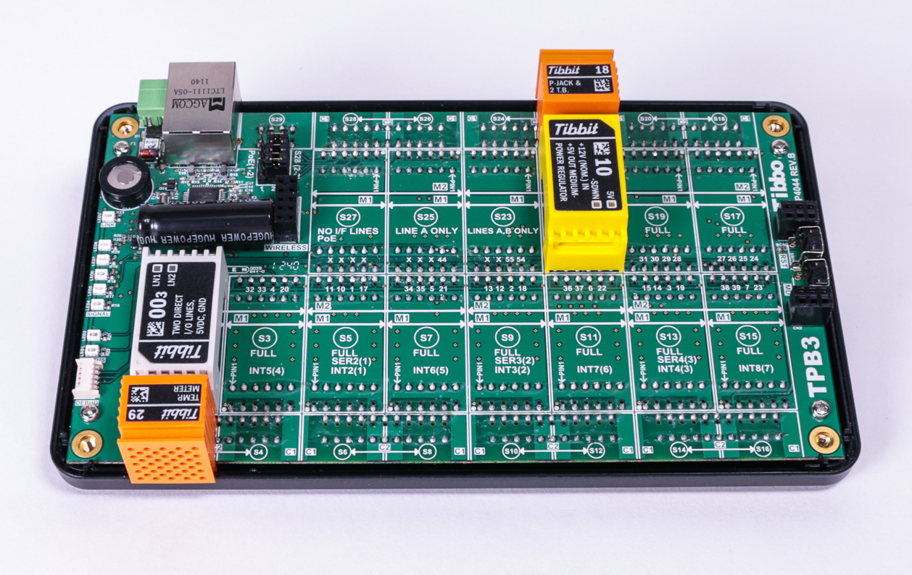

# Test Application for Ambient Barometric Pressure Sensor Tibbit #35

You will need:

- TPP2, TPP2(G2), TPP3, or TPP3(G2) board
- One Tibbit #35
- One Tibbit #00-3;
- Optionally, one Tibbit #9 or #10 (12V->5V regulator)
- Optionally, one Tibbit #18 (power jack)

*The last two Tibbits are necessary if you are going to power your rig from a 12V power adaptor. Alternatively you can supply regulated +5V power directly to the TPP.*

This project outputs sensor measurements using sys.debugprint. Therefore, you must run the project in the debug mode.

Photos below illustrate the test arrangement. All sensor Tibbits are plugged into the same socket S1.

